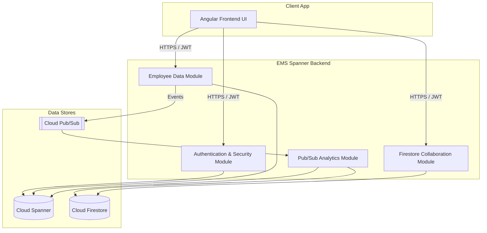
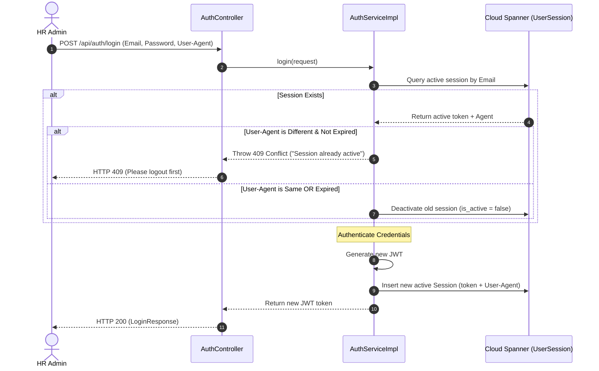
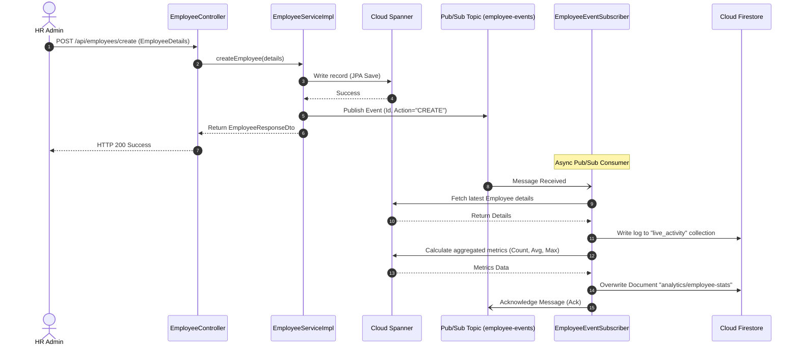
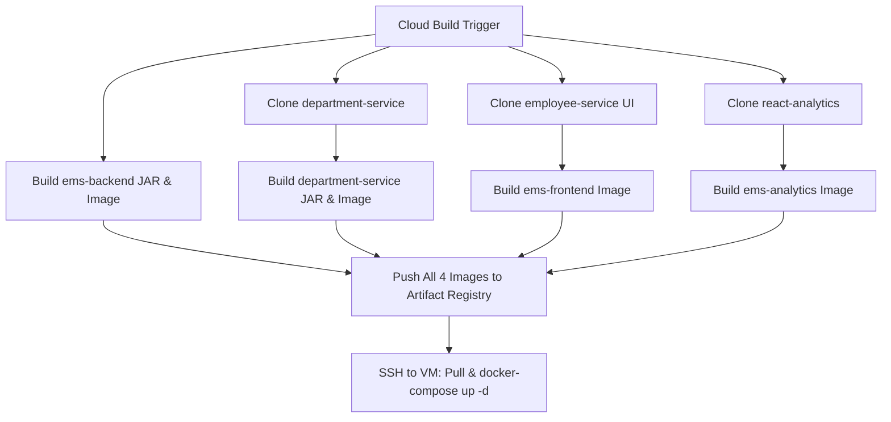

# EMS-Spanner Layered Architecture Design

This document details the software architecture design for **EMS-Spanner** (Employee Management System). The system leverages a **Layered Architecture** style integrated with **Event-Driven Messaging** and a **Polyglot Persistence Layer** (Google Cloud Spanner for transactional consistency and Google Cloud Firestore for low-latency collaboration and caching).

---

## 1. Architectural Style & Design Principles

EMS-Spanner is designed around clean separation of concerns, structured into four horizontal layers:

```
┌────────────────────────────────────────────────────────┐
│                   Presentation Layer                   │
│     (REST Controllers & CORS Config / Request Handlers) │
└───────────────────────────┬────────────────────────────┘
                            │ (DTOs / Request Objects)
                            ▼
┌────────────────────────────────────────────────────────┐
│                     Service Layer                      │
│       (Business Logic, Transaction Management, JWT)     │
└───────────────────────────┬────────────────────────────┘
                            │ (Domain Entities)
                            ▼
┌────────────────────────────────────────────────────────┐
│                   Data Access Layer                    │
│     (Spring Data JPA Repositories / Spanner SDK Client) │
└───────────────────────────┬────────────────────────────┘
                            │ (SQL Mutations / Operations)
                            ▼
┌────────────────────────────────────────────────────────┐
│                   Persistence Layer                    │
│        (Google Cloud Spanner & Cloud Firestore)        │
└────────────────────────────────────────────────────────┘
```

*   **Presentation Layer**: REST endpoints under [controller](file:///c:/Users/LENOVO/Desktop/employee%20management%20system%20spanner/ems-spanner/ems/src/main/java/com/example/ems/controller) package. Validates inputs, coordinates responses, and handles HTTP routing.
*   **Service Layer**: Encapsulates business logic, security validations, and orchestration. Contains interface specifications in [service](file:///c:/Users/LENOVO/Desktop/employee%20management%20system%20spanner/ems-spanner/ems/src/main/java/com/example/ems/service) and implementations in `service/impl`.
*   **Data Access Layer (Repository)**: Abstracts persistence queries. Utilizes Spring Data JPA interfaces for standard entities and direct Google Cloud Spanner SDK writes for custom session management.
*   **Persistence Layer**:
    *   **Google Cloud Spanner**: Primary relational database for ACID transactions.
    *   **Google Cloud Firestore**: Low-latency cache for employee metrics, real-time user presence, and lock tracking.

---

## 2. Logical Module Breakdowns

The application is structured into four core logical modules:



### A. Employee Data Module
Manages employee registration, profile updates, and department information.
*   **Key Responsibilities**: Create, update, search, delete, and paginated sorting of employees.
*   **Key Source Files**:
    *   [EmployeeController](file:///c:/Users/LENOVO/Desktop/employee%20management%20system%20spanner/ems-spanner/ems/src/main/java/com/example/ems/controller/EmployeeController.java) (CRUD endpoints)
    *   [EmployeeServiceImpl](file:///c:/Users/LENOVO/Desktop/employee%20management%20system%20spanner/ems-spanner/ems/src/main/java/com/example/ems/service/impl/EmployeeServiceImpl.java) (Business rules)
    *   [EmployeeRepository](file:///c:/Users/LENOVO/Desktop/employee%20management%20system%20spanner/ems-spanner/ems/src/main/java/com/example/ems/repository/EmployeeRepository.java) (Spring Data JPA queries)

### B. Authentication & Security Module
Handles administrative registration, token authentication, and session exclusivity.
*   **Key Responsibilities**: Secure endpoints, validate passwords, generate JWTs, and prevent concurrent logins from different `User-Agent` configurations.
*   **Key Source Files**:
    *   [AuthController](file:///c:/Users/LENOVO/Desktop/employee%20management%20system%20spanner/ems-spanner/ems/src/main/java/com/example/ems/controller/AuthController.java) (Login/logout endpoints)
    *   [JwtAuthFilter](file:///c:/Users/LENOVO/Desktop/employee%20management%20system%20spanner/ems-spanner/ems/src/main/java/com/example/ems/security/JwtAuthFilter.java) (Request token extractor)
    *   [AuthServiceImpl](file:///c:/Users/LENOVO/Desktop/employee%20management%20system%20spanner/ems-spanner/ems/src/main/java/com/example/ems/service/impl/AuthServiceImpl.java) (Session validation logic)
    *   [UserSessionRepository](file:///c:/Users/LENOVO/Desktop/employee%20management%20system%20spanner/ems-spanner/ems/src/main/java/com/example/ems/repository/UserSessionRepository.java) (Spanner Mutation writer)

### C. Firestore Collaboration Module
Enables real-time collaboration features for dashboard users.
*   **Key Responsibilities**: Acquire/release locks on employee profiles during editing, track which pages managers are currently viewing, and keep active presence indicators.
*   **Key Source Files**:
    *   [EmployeeController](file:///c:/Users/LENOVO/Desktop/employee%20management%20system%20spanner/ems-spanner/ems/src/main/java/com/example/ems/controller/EmployeeController.java) (Presence & Locks endpoints)
    *   [GcpServicesConfig](file:///c:/Users/LENOVO/Desktop/employee%20management%20system%20spanner/ems-spanner/ems/src/main/java/com/example/ems/config/GcpServicesConfig.java) (Firestore client creation)

### D. Pub/Sub Analytics Module
Asynchronously process profile changes to update analytical summaries and system event logs.
*   **Key Responsibilities**: Broadcast profile changes over Pub/Sub, subscribe to updates, write logs to the live activity feed, and compute real-time averages and distribution counts.
*   **Key Source Files**:
    *   [EmployeeEventPublisher](file:///c:/Users/LENOVO/Desktop/employee%20management%20system%20spanner/ems-spanner/ems/src/main/java/com/example/ems/pubsub/EmployeeEventPublisher.java) (Publish actions)
    *   [EmployeeEventSubscriber](file:///c:/Users/LENOVO/Desktop/employee%20management%20system%20spanner/ems-spanner/ems/src/main/java/com/example/ems/pubsub/EmployeeEventSubscriber.java) (Process actions & update caches)

---

## 3. Polyglot Database Design

EMS-Spanner leverages relational and document-based datastores depending on the access pattern constraints.

### A. Google Cloud Spanner Schema
Optimized for high transactional throughput and strong consistency.

| Table Name | Primary Key | Description |
| :--- | :--- | :--- |
| `departments` | `id` (INT64) | Stores department records. |
| `employees` | `id` (INT64) | Stores employee data, linked via `department_id`. |
| `users` | `id` (INT64) | Admin logins (Email, bcrypt password, role). |
| `user_sessions` | `id` (INT64) | Tracking token and browser agent. |

### B. Google Cloud Firestore Schema
Optimized for real-time syncing, low latency cache hits, and document structure.

| Collection Name | Document ID | Fields | Description |
| :--- | :--- | :--- | :--- |
| `analytics` | `employee-stats` | `totalEmployees`, `averageSalary`, `highestPaidEmployee`, `designationCounts` | Fast dashboard statistics cache. |
| `presence` | `{userEmail}` | `email`, `activePage`, `lastActive` | Tracks current views of online users. |
| `locks` | `{employeeId}` | `employeeId`, `lockedBy`, `lockedAt`, `expiresAt` | Prevents edit collisions. |
| `live_activity`| `{randomUUID}` | `id`, `title`, `message`, `type`, `severity`, `timestamp` | Live activity feed logs. |

---

## 4. Key Architectural Control Flows

### A. User Session & Login Exclusivity
Enforces a single active session per user across distinct browser agents.



### B. Employee Mutation & Asynchronous Analytics Sync
Illustrates the event-driven decoupling of profile writes from the heavy analytical computations.



---

## 5. Multi-Repository Physical Deployment & CI/CD Pipelines

To keep code ownership decoupled, the system is distributed across four distinct repositories. Deployment is unified centrally using **Google Cloud Build** (`cloudbuild.yaml`) or independently per service using **Jenkins Pipelines** (`Jenkinsfile`).

### A. Deployment Mapping

| Container / Service | Port (Host:Container) | Description | Repository URL |
| :--- | :--- | :--- | :--- |
| **ems-backend** | `8080:8080` | Java Employee Service | `https://github.com/chandbasha304/employee-service-backend.git` |
| **department-backend** | `8081:8080` | Java Department Service | `https://github.com/chandbasha304/department-service.git` |
| **ems-frontend** | `3000:80` | Angular Frontend Dashboard | `https://github.com/chandbasha304/employee-service.git` |
| **ems-analytics** | `3001:80` | React Analytics Dashboard | `https://github.com/chandbasha304/react-analytics.git` |

---

### B. Master Google Cloud Build Execution Flow



### C. Jenkins Pipeline Flow (Per-Service)
Each individual repository contains a `Jenkinsfile` executing:
1.  **Checkout**: Pulls code from Git.
2.  **Build**: Compiles source code (Maven package for Java, npm script/Docker multi-stage for UI).
3.  **Dockerize**: Builds the image tagged as `latest`.
4.  **Publish**: Authenticates with Artifact Registry (`gcloud auth configure-docker`) and pushes the image.
5.  **Deploy**: Connects to the local/target docker agent, stops/removes the prior container, and starts the container on the custom `ems-network` bridging port mappings.

